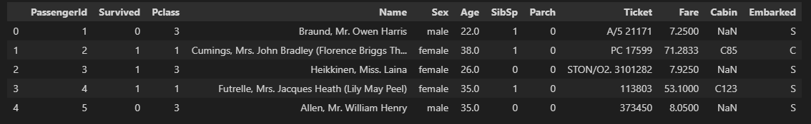

`kaggle` 의 튜토리얼이라고도 할 수 있는 타이타닉 생존자 예측하기 문제는 `Machine Learning` 이나 `Deep Learning` 입문자라면 누구나 한 번쯤 살펴보게 되는 문제이다. 

가장 간단한 형태의 분류 문제로서, 특별한 기교가 있는 건 아니지만 모델 학습을 시작하기 전 전처리의 기본은 한 번씩 구현해 볼만한 주제라 아래에 정리해 보려고 한다. 

본 포스팅에서는 전처리를 위한 Package 로 `Scikit Learn` 을 사용하고 `Tensor Flow` 를 이용한 Deep Learning 으로 결과를 예측해 보았다. 
<br/>
<br/>

# 주제
***
본 모델은 타이타닉 호 침몰 당시 사망에 영향을 끼칠만한 요인 분석을 통해 승객의 생존 여부를 예측하고자 함이다. 

Kaggle 및 데이터 파일은 아래 링크를 참고한다. 

[kaggle link][kaggle-link]
<br/>
<br/>

# 변수 설명
***
### PassengerId : 각 승객의 고유 번호
### Servived : 생존 여부 (종속 변수)
* 0 = 사망
* 1 = 생존

### Pclass : 객실 등급 
* 1st = Upper
* 2nd = Middle
* 3rd = Lower

### Name : 이름
### Sex : 성별
### Age : 나이
### SibSp : 동반한 형제자매, 배우자 수
### Parch : 동반한 부모, 자식 수
### Ticket : 티켓 번호
### Fare : 티켓 요금
### Cabin : 객실 번호
### Embarked : 승선한 항
* C = Cherbourg
* Q = Queenstown
* S = Southampton
<br/>
<br/>

# Code

***

### `Tensorflow`, `Pandas`, `Numpy` Package Import

```python
import tensorflow as tf
import numpy as np
import pandas as pd
```

### train, test csv 파일을 `Pandas` 로 load
```python
train_df = pd.read_csv('train.csv')
test_df = pd.read_csv('test.csv')

```

### train, test dataset 검토

>각 `Datatable` 을 조회  해서 어떤 `Column` 들이 포함되어 있는지, 어떤 형태의 값들이 들어 있는지, `NaN` 값이나 이상치가 보이는지 검토한다. 

```python
# 위에서 5개 열 조회
train_df.head()
```



<br/>

### 결측치 검토

>`Datatable` 의 `.isna().sum()` 함수를 이용해서 결측치가 몇 개나 있는지 확인한다. 

`Age` 와 `Cabin`, `Embarked` 항목에 `NaN` 값이 들어가 있는 것을 확인할 수 있다. 

```python
# 결측치 조회
train_df.isna().sum()

PassengerId      0
Survived         0
Pclass           0
Name             0
Sex              0
Age            177
SibSp            0
Parch            0
Ticket           0
Fare             0
Cabin          687
Embarked         2
dtype: int64
```
<br/>

### 결측치 보정

>모델 생성을 위해 Table 의 결측치 값을 채워줘야 한다. 

`Cabin` 과 `Embarked` 값은 재워주지 않고 `Age` 값만 채워주기로 하였다. 나머지 두 값의 공란을 안 채우는 이유는 아래에 후술한다. 

이를 위해 `sklearn` 의 `SimpleImputer` 를 사용할 것이며, 빈 값을 해당 Column 의 평균 (`mean`) 값으로 채워주게 하였다. 

`SimpleImputer` 의 `Strategy` 를 `mean` 이 아닌 `median`(중앙값), `most_frequent`(최빈값), `constant` (특정값, fill_value 설정 필요) 으로 설정할 수도 있다. 

```python
# Import SimpleImputer
from sklearn.impute import SimpleImputer

# padding 함수 정의
def nan_padding(data,columns):
    for column in columns:
        imputer = SimpleImputer(strategy='mean')
        data[column] = imputer.fit_transform(data[[column]])
    return data

# padding 할 항목 선택 (Age)
nan_columns = ['Age']

# padding 실행
train_df = nan_padding(train_df,nan_columns)
test_df = nan_padding(test_df,nan_columns)
```
<br/>

### 필요 없는 Column 제거

>생존 여부를 예측하는데에 도움이 안 되는 Column 을 제거한다. 

생존 여부와 관계가 없는 값이 모델 학습에 이용되는 경우 모델의 정확도를 떨어뜨리기 때문에 제거해 주는 것이 좋다. 

```python
# drop 함수 정의
def drop_not_concerned(data,columns):
    return data.drop(columns,axis=1)

# 제거할 항목 선택
not_concerned = ['PassengerId','Name','Ticket','Fare','Cabin','Embarked']

# drop 실행
train_df = drop_not_concerned(train_df,not_concerned)
test_df = drop_not_concerned(test_df,not_concerned)
```
<br/>

### `One-hot Encoding`

>범주형 항목 (몇 가지 값중 선택하는 경우) 은 그대로 학습 시키지 않고 `One-hot encoding` 을 통해 값을 각 항목에 해당하는 Column (0 또는 1 값을 가지는) 으로 변환해서 학습시켜야 한다. 

예를 들어 이 모델에서 `PClass` 값이 1, 2, 또는 3 의 값을 가지고 있는데 이런 경우 PClass Column 을 `PClass_1`, `PClass_2`, `PClass_3` 으로 나눈다. 

만약 해당 인원의 `PClass` 값이 1이라면 `PClass_1` 의 값을 1로 놓고 `PClass_2`, `PClass_3` 의 값을 0 으로 둔다. 

`PClass` 를 그대로 1,2,3 의 값인 상태로 모델을 학습시키면 값이 값이 높을 경우의 `PClass` 영향도가 더 커질 수 있다. 숫자 값의 크고 작음이 생존 여부와 직결되지 않는다면 `One-hot encoding` 을 하는 것이 좋다. 

`One-hot encoding` 에 대한 자세한 설명은 별도 포스팅이 필요할 거 같다... 

`One-hot encoding` 을 하는 방법은 여러가지가 있는데, 여기에서는 `Pandas` 의 `get_dummies` 를 활용한다. 

```python
# One-hot encoding 함수 정의
def dummy_data(data, columns):
    for column in columns:
        data = pd.concat([data,pd.get_dummies(data[column], prefix=column)],axis=1)
        data = data.drop(column,axis=1)
    return data

# Encoding 대상 선택
dummy_columns = ['Pclass']

# One-hot encoding 실행
train_df = dummy_data(train_df,dummy_columns)
test_df = dummy_data(test_df,dummy_columns)
```
<br/>

### `Label Encoding`

>숫자 값이 아닌 문자열 값의 경우 모델 학습이 불가능하므로, 각 문자열 값을 숫자로 치환해 줘야 한다.  

이 모델에서는 Sex 값이 문자열로 되어 있다. 

`One-hot encoding` 을 사용하면 Sex_mail, Sex_femail 이라는 두 Column 으로 값을 나눠 주겠지만, `Label encoding` 은 Sex 값을 mail, femail 값 각각 0, 1 로 변환해 준다. 

만약 Sex 의 값이 3개 이상의 범주로 형성되어 있다면 `One-hot encoding` 이 더 적절하지만, 남자인지 '여부' 가 생존에 영향을 끼쳤다면 0,1 값으로 학습을 시켜도 충분한 결과를 얻을 수 있다. 

`sklearn` 의 `LabelEncoder` 를 활용해 보자. 

```python
# Import LabelEncoder
from sklearn.preprocessing import LabelEncoder

# Label Encoding 함수 정의
def sex_to_int(data):
    le = LabelEncoder()
    le.fit(['male','female'])
    data['Sex'] = le.transform(data['Sex'])
    return data

# 함수 실행
train_df = sex_to_int(train_df)
test_df = sex_to_int(test_df)
```
<br/>

### `Data Normalization` (정규화)

>만약 특정 Column 의 값이 다른 Column 의 값들보다 Scale 이 크고 변동폭이 크다면 해당 Column 이 모델에 실제보다 더 큰 영향을 끼칠 가능성이 크다. 

이를 방지하기 위해 해당 값을 특정 범위 이내로 정규화 해 주는 작업이 필요하다. 

정규화에는 여러가지 방법이 있으며 본 포스팅에서는 `sklearn` 의 `MinMaxScaler` 를 활용한다. 

`Age` 를 제외한 나머지 값은 모두 0 또는 1 의 값을 가지고 있지만 `Age` 의 값은 수십 이상의 값을 가지고 있기 때문에 `Age` 값을 정규화 해 보자. 

```python
# Import MinMaxScaler 
from sklearn.preprocessing import MinMaxScaler

# 정규화 함수 정의
def normalize(data,columns):
    for column in columns:
        scaler = MinMaxScaler()
        data[column] = scaler.fit_transform(data[[column]])
    return data

# 정규화 대상 Column 정의
normalize_columns = ['Age']

# 함수 실행
train_df = normalize(train_df,normalize_columns)
test_df = normalize(test_df,normalize_columns)
```
<br/>

### 결과값 분리

>본 데이터 셋은 학습 데이터와 결과 값 (생존여부 `Survived`) 이 하나의 Table 로 되어 있기 때문에 y 값을 분리해 주는 작업이 필요하다. 

Test 데이터셋의 생존 여부 값이 `gender_submission.csv` 라는 별도 파일로 있다. 

```python
# Train Data frame 복사 후 'survived' Column 을 분리
train_X = train_df.copy()
train_y = train_X.pop('Survived')

# Test Data frame 복사 후 생존 여부 값은 'gender_submission.csv' 파일에서 가져옴
test_X = test_df.copy()
test_y = pd.read_csv('gender_submission.csv')
test_y.drop('PassengerId',axis=1,inplace=True)
```
<br/>

### `Tensor Flow` 모델 정의

드디어 전처리가 완료 되었고 모델 학습을 시작할 수 있다. 

0 (사망) 또는 1 (생존) 을 예측하는 분류 문제이기 때문에 `Loss` 로는 `BinaryCrossentropy`, 출력 Layer 의 활성화 함수는 `sigmoid` 를 사용하였다. 

`Optimizer` 는 `Adam` 을 사용하였고, 중간 Dense Layer 구조는 특별할 게 없다. 

```python
loss = tf.keras.losses.BinaryCrossentropy()
optimizer = tf.keras.optimizers.Adam()

model = tf.keras.Sequential()
model.add(tf.keras.layers.Input(shape=[len(train_X.keys())]))
model.add(tf.keras.layers.Dense(64,activation='relu'))
model.add(tf.keras.layers.Dense(32,activation='relu'))
model.add(tf.keras.layers.Dense(1,activation='sigmoid'))

model.compile(optimizer=optimizer,loss=loss,metrics=['acc'])

```
<br/>

### `Tensor Flow` 모델 학습

앞에서 정의한 모델을 전처리 완료한 데이터 기반으로 학습해보자. 

```python
# 500 Epoch
epoch = 500

# 20% 의 Train 데이터를 Validation 으로 활용
valid_split = 0.2

# 학습 실행 후 history 에 진행 결과를 저장
history = model.fit(x=train_X,y=train_y,epochs=epoch,validation_split=valid_split)
```
<br/>

### 학습 결과 테스트

```python
model.evaluate(x=test_X,y=test_y)
```
<br/>

학습 결과 값은 아래와 같다. 

[0.35380762815475464, 0.9234449863433838]

92.3% 확률로 생전 여부를 맞출 수 있었다. 

[kaggle-link]: https://www.kaggle.com/c/titanic